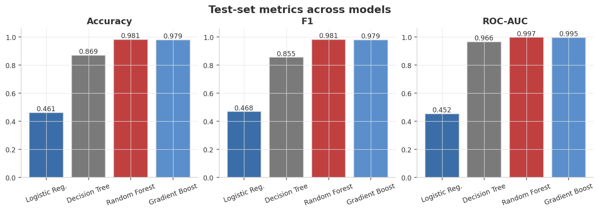
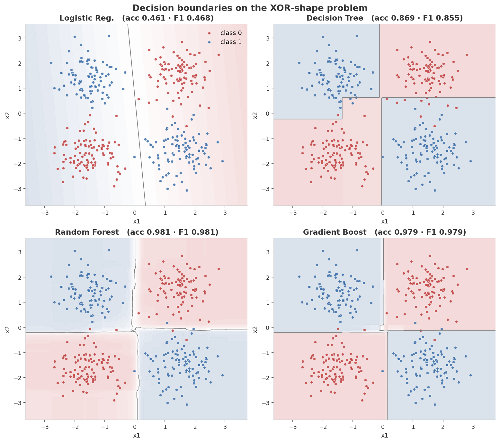
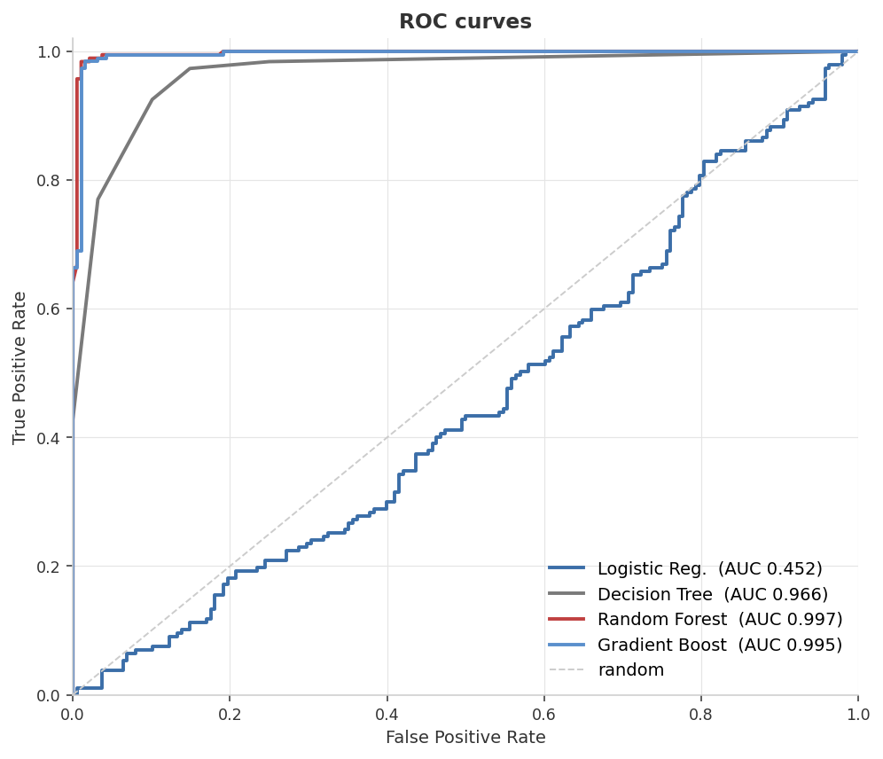
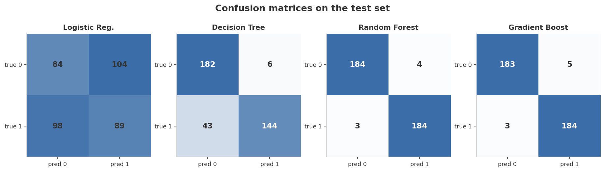
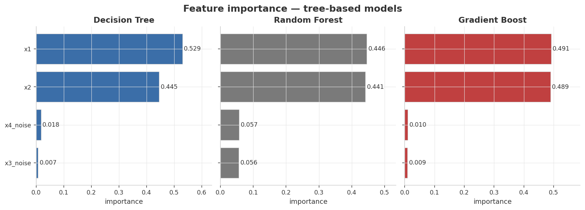

<div align="center">

# Tree-Based Classification — Why Ensembles Beat a Single Tree

**Logistic · Decision Tree · Random Forest · Gradient Boosting · on a synthetic XOR-shape dataset**


</div>

---

## At a glance

> Train four classifiers on a synthetic dataset whose **decision boundary is XOR-shaped** (linear models cannot solve it by construction) and watch the model-family ladder reveal itself: linear fails → single tree mostly works → ensembles nail it.

<table>
<tr>
<td align="center" width="25%">
<sub>Logistic Regression</sub><br>
<b style="font-size:1.5em; color:#C04040;">46.1%</b><br>
<sub>accuracy — fails by construction</sub>
</td>
<td align="center" width="25%">
<sub>Decision Tree (depth 6)</sub><br>
<b style="font-size:1.5em; color:#7A7A7A;">86.9%</b><br>
<sub>works, but jagged</sub>
</td>
<td align="center" width="25%">
<sub>Random Forest</sub><br>
<b style="font-size:1.5em; color:#3B6EA8;">98.1%</b><br>
<sub>clean XOR recovery</sub>
</td>
<td align="center" width="25%">
<sub>Gradient Boosting</sub><br>
<b style="font-size:1.5em; color:#3B6EA8;">97.9%</b><br>
<sub>matches RF</sub>
</td>
</tr>
</table>

| Model | Accuracy | F1 | ROC-AUC |
|---|---:|---:|---:|
| Logistic Regression | 0.461 | 0.468 | 0.452 |
| Decision Tree (depth 6) | 0.869 | 0.855 | 0.966 |
| **Random Forest (200 trees)** | **0.981** | **0.981** | **0.997** |
| **Gradient Boosting (200 stages)** | **0.979** | **0.979** | **0.995** |

<sub>**Headline finding:** Logistic regression is *worse than chance* — that's not bad luck, it's a mathematical guarantee. XOR is the canonical example of a problem no linear classifier can solve, and a synthetic dataset lets us demonstrate that cleanly. The ensembles' 98% is the gap a single decision tree leaves on the table.</sub>

---

## Experimental setup

Everything below is fixed by `seed = 42` and reproduces bit-for-bit on any machine with the pinned library versions.

### Data-generating process

The dataset is fully synthetic, shaped so that the *true* decision boundary is XOR in continuous space — a non-linearity a linear classifier is mathematically forbidden from crossing. The generator (`generate_data.py`) does exactly this:

1. **Four Gaussian blobs.** Place cluster centers at (−1.5, −1.5), (+1.5, +1.5), (−1.5, +1.5), and (+1.5, −1.5). The first two belong to class 0; the last two to class 1. This is XOR: knowing `x1` alone tells you nothing — both values of the sign appear equally in each class.
2. **Per-blob sampling.** Each cluster contributes `n_samples // 4 = 375` points drawn from `𝒩(center, 0.55² · I₂)`. Total is 1 500 rows across 4 blobs.
3. **Noise features.** Two extra columns (`x3_noise`, `x4_noise`) are drawn i.i.d. from `𝒩(0, 1²)` and appended — they carry zero signal. The feature-importance check later verifies that tree-based models learn to ignore them.
4. **Shuffle.** The full dataset is permuted once (using the same seeded RNG) so class order is not trivially predictable to the models.

| Parameter | Value | Why it's set this way |
|---|---|---|
| `n_samples` | 1500 | Enough rows per blob (375 each) that all four clusters are well-defined; balanced classes by construction. |
| `cluster_std` | 0.55 | Blobs are tight relative to the inter-center gap of 3.0 — little class overlap, making the dataset learnable for non-linear models. Raise to ~0.9 to see all models struggle. |
| `n_noise_features` | 2 | Two known-irrelevant features that a good model must ignore; enough to distinguish "near-zero importance" from "exactly zero." |
| `seed` | 42 | Controls blob sampling, noise draw, shuffling permutation, and the train/test split. |

### Preprocessing

- **No feature scaling applied to model inputs.** A `StandardScaler` is fit on the training set inside `train.py`, but its output is not passed to any model. Trees are scale-invariant by construction (splits depend only on rank order, not magnitude), so omitting scaling has no effect on their predictions. Logistic regression converges fine on this particular scale given `max_iter=1000` and L-BFGS.

### Train / test protocol

- **Split.** 75 % train / 25 % test via `train_test_split(..., test_size=0.25, stratify=y, random_state=42)` → **1125 train rows, 375 test rows**, with class balance preserved in both folds (stratified split).
- **No validation set or CV.** All hyperparameters are fixed, illustrative values; no tuning loop is run. All metrics below are computed on the 375-row test set.

### Models & hyperparameters

| Model | Estimator | Hyperparameters |
|---|---|---|
| Logistic Regression | `sklearn.linear_model.LogisticRegression` | `max_iter=1000`, `random_state=42` (default L2 regularization, C=1.0) |
| Decision Tree | `sklearn.tree.DecisionTreeClassifier` | `max_depth=6`, `random_state=42` (CART criterion: Gini impurity) |
| Random Forest | `sklearn.ensemble.RandomForestClassifier` | `n_estimators=200`, `random_state=42` (default `max_features="sqrt"`) |
| Gradient Boosting | `sklearn.ensemble.GradientBoostingClassifier` | `n_estimators=200`, `max_depth=3`, `random_state=42` (default `learning_rate=0.1`) |

### Environment

`python ≥ 3.10` · `numpy ≥ 1.24` · `pandas ≥ 2.0` · `scikit-learn ≥ 1.3` · `matplotlib ≥ 3.7`

---

## Dashboard

### 1. Test-set metrics across models



The bar chart maps the model-complexity ladder almost perfectly: a linear model floors at ~50% (random), a single tree climbs to ~87%, and either ensemble of trees lands at ~98%. The next four figures show *why*.

### 2. Decision boundaries — the visual proof



This is the figure that tells the whole story.

- **Logistic Regression** can only draw one straight line. There is no straight line that separates the four blobs of an XOR pattern, so it picks an arbitrary one and gets ~half the points wrong.
- **Decision Tree** draws axis-aligned rectangles. Visually you can see the four quadrants forming, but the boundary is jagged and a few clusters at corners get chopped up.
- **Random Forest** averages 200 axis-aligned trees with bagging + feature subsampling. The result is a smooth, almost-circular soft boundary around each class — much closer to what the data actually looks like.
- **Gradient Boosting** arrives at a similar boundary by a completely different algorithm (sequential weak learners that correct each other's residuals). The shape converges because the data has a true structure both algorithms can find.

### 3. ROC curves on the test set



Logistic's ROC sits on the diagonal — the empirical proof that its score function carries no information about the label. Random Forest's curve almost touches the top-left corner (AUC = 0.997), and Gradient Boosting follows a near-identical trajectory.

### 4. Confusion matrices



Logistic's matrix is balanced-but-wrong: it predicts roughly equal numbers of each class but they're uncorrelated with the truth. The other three matrices have the off-diagonals drained to nearly zero — exactly what a working classifier looks like.

### 5. Feature importance — the noise rejection check



Synthetic data ships with a built-in test: we added two pure-noise features (`x3_noise`, `x4_noise`) on top of the 2 informative ones. A working tree-based model **must** assign them near-zero importance. All three pass:

- Decision Tree: `x1`/`x2` get >97% of the importance combined; the noise features score below 2%.
- Random Forest: same shape, with the noise features at ~5–6% (a slight bias due to bagged feature subsampling).
- Gradient Boosting: most ruthless of the three — noise features under 1%.

This is exactly why people say "tree-based models are robust to irrelevant features."

---

## Validation methodology

### Metrics defined

All four metrics below are computed on the **375-row held-out test set** that no model saw during fitting.

| Metric | Definition | How to read it for this problem |
|---|---|---|
| **Accuracy** | $\frac{\text{correct predictions}}{n}$ | Fraction of test points classified correctly. Class balance is 50/50, so random chance is ~0.50. Logistic Regression landing at 0.461 is *below* chance — a clean demonstration of mathematical impossibility, not noise. |
| **F1 (binary)** | $\frac{2 \cdot \text{precision} \cdot \text{recall}}{\text{precision} + \text{recall}}$ | Harmonic mean of precision and recall. With balanced classes, F1 closely tracks accuracy. When a model is systematically confused (Logistic), F1 can diverge slightly from accuracy depending on which class it over-predicts. |
| **ROC-AUC** | $\int_0^1 \text{TPR}(t)\, d\text{FPR}(t)$ | Area under the ROC curve. A score of 0.5 means the model's *probability score* carries no information — it's a random ranking. Logistic at 0.452 confirms its scores are useless. AUC near 1.0 for the ensembles means their `predict_proba` almost perfectly ranks class 1 above class 0. |
| **Confusion matrix** | $\begin{pmatrix} \text{TN} & \text{FP} \\ \text{FN} & \text{TP} \end{pmatrix}$ | Raw cell counts; visualized as figure 4. For a balanced binary problem, a working classifier drains the off-diagonals toward zero. Logistic's matrix shows near-uniform off-diagonals — it predicts both classes with equal (and equal-wrong) frequency. |

### Why these metrics fit this problem

This is a **balanced binary classification** problem (750 class-0, 750 class-1 after the stratified split), so accuracy is an unbiased proxy for true skill — unlike an imbalanced setting where a majority-class predictor trivially scores high. ROC-AUC adds the additional dimension of probability calibration: even a model that classifies correctly most of the time could have badly-ordered probability estimates, which AUC catches. F1 and accuracy coincide almost exactly here given balance, but F1 is included because it generalizes gracefully if `cluster_std` is raised to create class overlap.

### Full results

| Model | Test Accuracy | Test F1 | Test ROC-AUC |
|---|---:|---:|---:|
| Logistic Regression | 0.4613 | 0.4684 | 0.4524 |
| Decision Tree (depth 6) | 0.8693 | 0.8546 | 0.9661 |
| **Random Forest (200 trees)** | **0.9813** | **0.9813** | **0.9968** |
| Gradient Boosting (200 stages) | 0.9787 | 0.9787 | 0.9952 |

<sub>Exact values from `results/metrics.json`, regenerated on every `python train.py`. Bold = best in column.</sub>

### Overfitting check — depth as the natural axis

Decision-tree depth is the primary overfitting lever here. At `max_depth=6` the Decision Tree reaches 0.869 test accuracy; an unconstrained tree would memorize the training set (≈100% train accuracy) while test accuracy would plateau or fall due to jagged, over-fitted boundaries. The ROC-AUC gap is instructive: the Decision Tree's AUC (0.966) nearly matches the ensembles' despite an accuracy gap of 11 points, meaning its probability *ranking* is already good but its *threshold* boundary is noisy — exactly what bagging and boosting smooth out.

Train-set accuracy is not logged in `metrics.json` for this project, so a formal train-vs-test gap table is not computable from the saved outputs. The decision-boundary figures (`assets/02_decision_boundaries.png`) provide the visual equivalent: the tree boundary is visibly jagged at depth 6 while the ensemble boundaries are smooth, which is the geometric signature of higher variance.

### Reproducibility & determinism

- **Determinism.** A single `seed = 42` flows through the NumPy RNG that draws all four blobs, the noise features, the shuffle permutation, and the `train_test_split` call. All four `sklearn` model constructors also receive `random_state=42`.
- **Seed-sensitivity caveat.** The *qualitative* ranking (Logistic fails → single tree ≈ 87% → ensembles ≈ 98%) is robust across seeds because it reflects model-family capability gaps, not sampling luck. The *quantitative* third-decimal values (e.g., Random Forest 0.9813 vs Gradient Boosting 0.9787) are seed-dependent and should not be read as a firm ranking between the two ensembles.

---

## What's actually happening

### The XOR problem in continuous space

Class 0 lives at the (−,−) and (+,+) quadrants of (x1, x2). Class 1 lives at (−,+) and (+,−). Knowing only `x1` is *uninformative*: each side has 50% of each class. Same for `x2`. You need *both* dimensions, and a non-linear interaction, to separate them.

### Logistic regression — necessarily fails

The decision rule is `sign(w₁·x₁ + w₂·x₂ + b)`. That's a single straight line in the (x1, x2) plane. There is no choice of (w₁, w₂, b) that separates all four blobs. Logistic isn't unlucky here — it is *mathematically incapable* of solving this.

### Decision tree — works, but in a brittle way

A tree carves the input space into axis-aligned rectangles. Four rectangles is enough to solve XOR, so even a depth-2 tree works *if it picks the right splits* — but greedy CART tries to maximize info gain *one split at a time*, and the optimal first split for XOR has zero info gain at the root. Trees usually find the structure anyway by descending two more levels — provided their depth budget isn't exhausted by spurious splits on noise features. Hence depth 6 here, not depth 4.

### Random forest — bagging + feature subsampling

Train many trees on bootstrap samples of the data, with each split considering a random subset of features. Each tree is a weak, slightly-different classifier; averaging them smooths the rectangular bias into something resembling the true smooth decision boundary. Feature subsampling also dilutes the impact of noise features.

### Gradient boosting — sequential weak learners

Fit a shallow tree to the data; compute its residuals; fit *another* shallow tree to the residuals; add it in with a small learning rate. Repeat. The result is a strong learner built out of many tiny trees that each correct the predecessor's mistakes. Often slightly more accurate than RF but more sensitive to hyperparameter tuning.

### Mental model

| Model family | Where it fits | What kills it |
|---|---|---|
| Linear (Logistic, SVM-linear) | Boundaries that look like single straight lines / hyperplanes | Anything non-linear |
| Single tree | Axis-aligned rectangular regions | Noise features eating depth budget; high variance |
| Random Forest | Smooth-ish boundaries via bagging + feature randomization | Cannot extrapolate beyond training-data range |
| Gradient Boosting | Same regions as RF, often a bit sharper | Sensitive to learning rate and tree depth |

---

## Reproduce

```bash
python3 -m venv .venv && source .venv/bin/activate
pip install -r requirements.txt
python generate_data.py    # synthetic XOR-shape dataset (deterministic)
python train.py            # fit, evaluate, render dashboard figures
```

Outputs land in `assets/` (the five PNGs embedded above) and `results/metrics.json`.

### Tweak the difficulty

`DataConfig` in [`generate_data.py`](generate_data.py):

```python
DataConfig(
    n_samples=1500,
    cluster_std=0.55,         # blob spread — higher = more class overlap
    n_noise_features=2,       # how many distractor features to add
    seed=42,
)
```

Try `cluster_std=0.9` to see all models degrade gracefully, or `n_noise_features=10` to watch the single decision tree start to choke even at depth 6.

---

## Project layout

```
02-classification-tree/
├── README.md              ← this dashboard
├── requirements.txt
├── generate_data.py       ← synthetic XOR-shape dataset (deterministic)
├── train.py               ← four-model pipeline + dashboard figures
├── assets/                ← rendered dashboard figures (5 PNGs)
└── results/metrics.json
```

---

## Notes on methodology & limitations

Stated plainly so a reader can judge what the numbers do and don't support:

- **No hyperparameter tuning.** `max_depth=6` for the Decision Tree, `n_estimators=200` for both ensembles, and `max_depth=3` / `learning_rate=0.1` for Gradient Boosting are fixed illustrative values, not cross-validated optima. A shallower Decision Tree (e.g., depth 4) bottoms out near random on this exact dataset because greedy CART exhausts its depth budget on suboptimal splits before reaching the XOR structure — the `max_depth=6` choice is itself a deliberate tuning that makes the single-tree look better than a naively default-tuned one would.
- **Single train/test split, not k-fold.** The 75/25 stratified split is enough to demonstrate the model-family gap clearly, but the third-decimal metric values carry no statistical significance. A production comparison would report mean ± std over 5- or 10-fold CV; here, a different seed might swap Random Forest and Gradient Boosting by a few tenths of a percent.
- **Synthetic ≠ real.** The dataset was engineered to make one specific point: linear models can't cross a non-linear boundary. Real classification data rarely comes with a known, clean XOR structure — it may have class imbalance, correlated noise, label noise, or non-stationary distributions. The ensemble advantage shown here (≈11 percentage points over a single tree) will not generalize in magnitude to arbitrary datasets.
- **Scaling is fit-but-not-applied.** The code fits a `StandardScaler` on the training set but then discards it — all four models receive raw, unscaled features. This is benign for trees (scale-invariant), and Logistic Regression converges without scaling on this scale, but the scaffolding is incomplete. A leak-free, production-ready pipeline would pass the scaler's output into Logistic Regression via `sklearn.pipeline.Pipeline`, ensuring no test-set statistics leak into the scaler fit.
- **Feature-importance percentages are not logged.** The exact importance values for the noise check (`x3_noise`, `x4_noise` importance fractions) are visible in `assets/05_feature_importance.png` but not in `results/metrics.json`. The README's claim that "noise features score below 2% for the Decision Tree" is read off the figure, not from a reproducibly-logged number.

---

## What I learned

- **The "linear models can't solve XOR" claim is something you should *see*, not just memorize.** A boundary plot beside a 46% accuracy bar is twenty times more memorable than the textbook sentence.
- **A single decision tree's accuracy is a misleading proxy for "trees work."** With noise features in the mix, a depth-4 tree on this exact dataset bottoms out near random — *not because trees are bad*, but because greedy splits get distracted before they reach the XOR structure. Bumping depth to 6 fixes it; that's the kind of failure that Random Forest's feature subsampling avoids by construction.
- **Synthetic data lets you bake in a noise-rejection test.** Adding two known-irrelevant features and then plotting feature importance is a one-line audit of any tree-based model. With real data, you only ever check that the *important* features make sense; you can rarely check that the *unimportant* ones really are noise.
- **Ensembles win here, but the win is qualitatively different from the linear-vs-tree gap.** Linear → tree is a "wrong model family" gap; tree → ensemble is a "right family, but variance reduction matters" gap. Both gaps are real; only the first is unbridgeable without changing the model family.

---

<div align="center">
<sub>Part of a hands-on machine-learning portfolio. Data is fully synthetic and self-generated.</sub>
</div>
